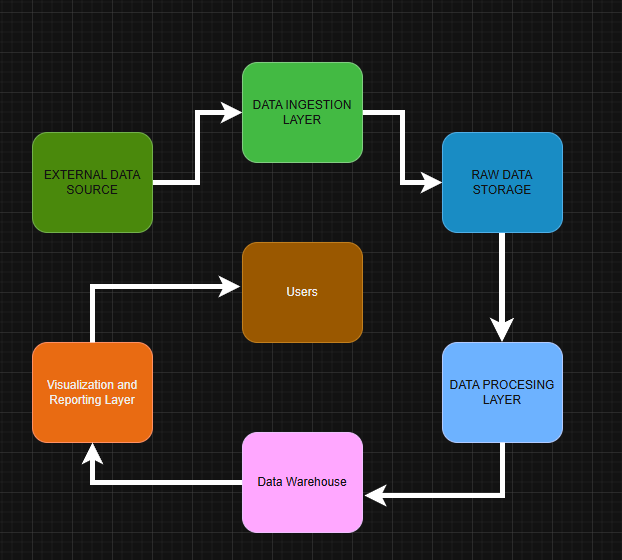
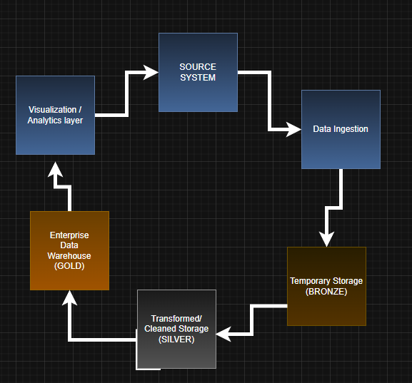
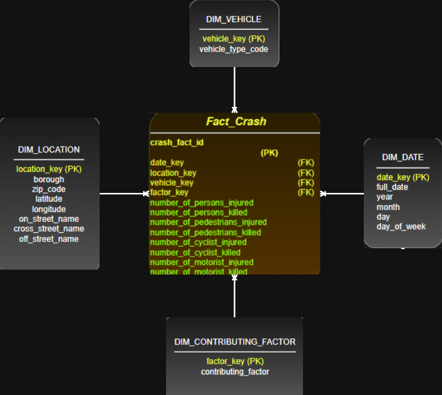
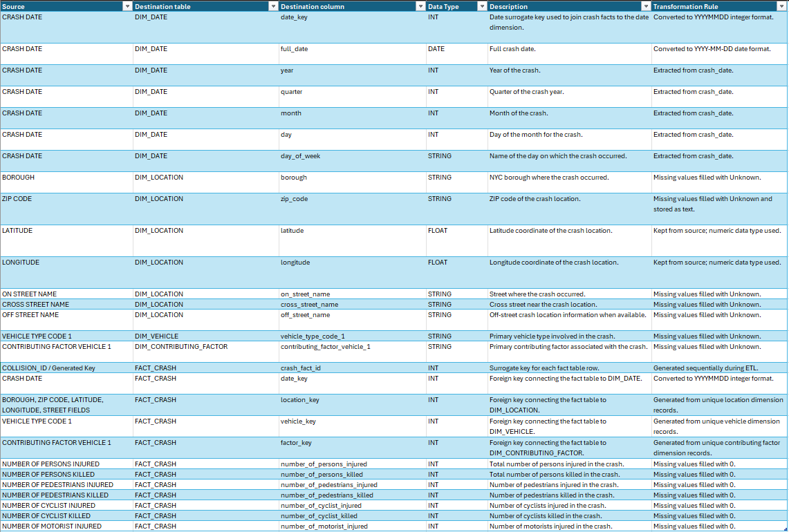
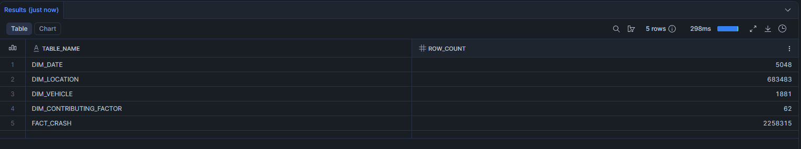
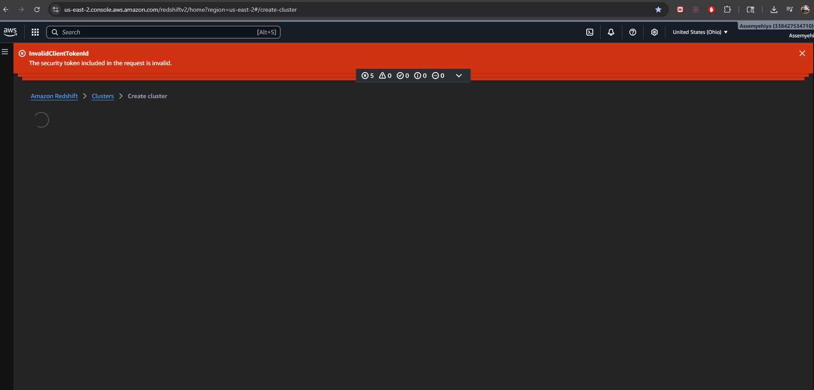
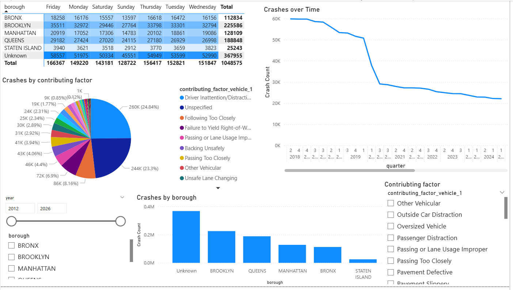
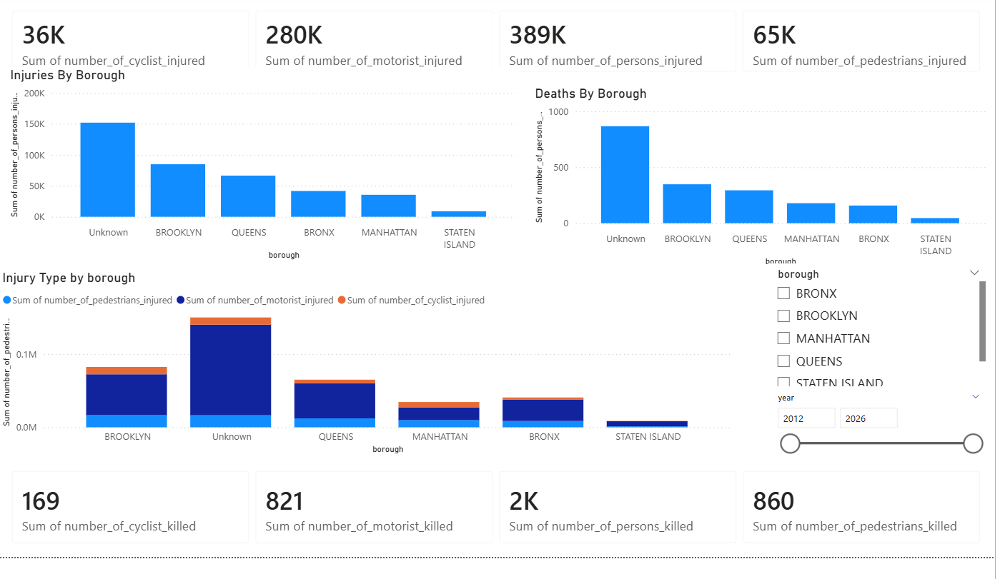
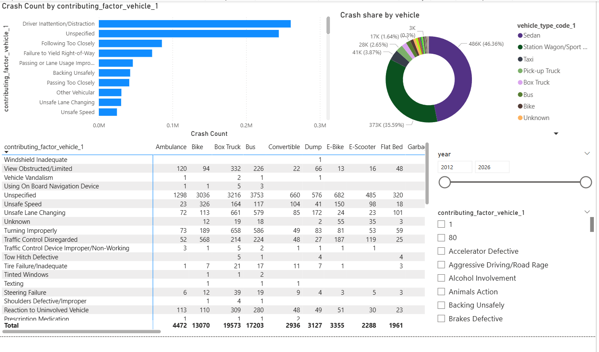
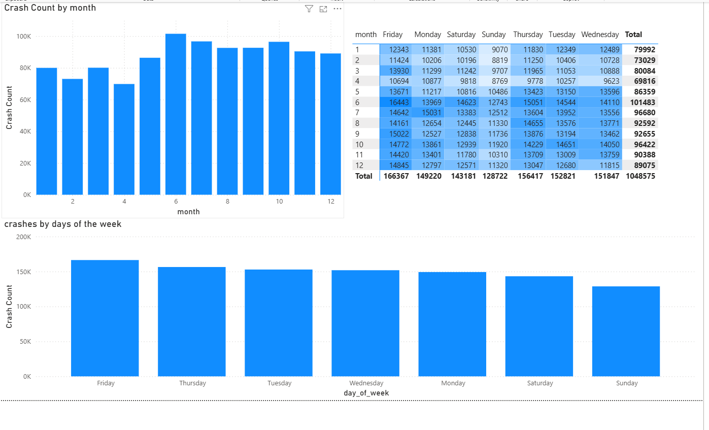

# CIS-4400-Spring-2026-Projects Assem Yehiya

# HW1

## Problem Context 

Car crashes in New york city are a huge issue, they result in injuries and deaths and damage to property all across the city. To try to improve the safety of people in the city we need to actually see and understand what factors contribute to these accidents and when and where they usually happen. This is the aim of this project. Where ill take the “NYC Motor Vehicle Collisions” dataset from NYC open data and then ill analyze it to try and see if there is any patterns, whether in crash occurrences, injuries, and other factors that may have an impact. By organizing the data into a structured data warehouse and creating visualizations of the data which will help analysts or city officials better understand the data and trends which can allow for solutions to be created.

## Business Requirements

1. Need to identify any crash trends across New York City and in different times
2. Look for and find any contributing factors that are correlated with injuries and deaths
3. Give the final product to Analysts and city officials for safety planning

## Functional Requirements

1.The System must get the “motor vehicle collision” data from the nyc open data, using either a API or just downloading it as a csv

2.The system has to store the raw data in a centralized storage environment to process later 

3.The system has to transform and clean the data, including making dates into standard formats and filling or removing missing or duplicate values. 

4.The system has to then load the cleaned data into a data warehouse with facts and dimension tables

5.The system should have data able to made into visualization and also querying to see crash trends, deaths, and any factors or possible causes using analytic tools

## Data Requirements

1. This project will use the “nyc motor vehicle collisions” dataset from NYC open data. This dataset has very detailed, and event level records of crashes that have been reported across the city. It’s got more than a million records and also more than 20 columns.

2. Each row is one collision event, and the columns are attributes like, date, time, locations, number of injuries,deaths, factors, and vehicle types. 

3. The data can be downloaded in a csv format or by using the API for processing. 

4. A custom dictionary was made to document the selected fields, it lists their description, data types. And constraints. 

5. This data is a good use for data warehousing because it has structured, transactional data and can also be analyzed across multiple different dimensions, such as time, locations, and factors.

## Information Architecture

1. Data is gathered from an external data source
2. The data enters the data ingestion layer, where it is taken for processing
3. The raw Data is then stored in a storgae layer so that the original source data is perserved
4. The dta then moves into the processing layer, where it will be cleaned, standerdized, and prepped for analysis
5. The processed data is then loaded into a data warehouse, where it is organaized into fact and dimension tables
6. The visualization and reporting layer presents the info in a usable format
7. Business users, like analysts and city officals access the reports and dashboards to see trends, injuires, deaths, and factors that contributed.

## Data Architecture

1. The data architecture is the flow of how data is collected, processed, and stored within the project.
2.  The Data ingestion layerr gets the data from thje source
3. The data is first stored in a temp raw storage layer which is (bronze), which holds onto the original data
4. the data is then cleaned and standardized and transfromed into a processed sotrage layer (SILVER)
5. After transfromation the structured data is loaded into the enterprise data warehouse (GOLD)
6. The Data warehouse supports downstream analytics, reporting, and visulization 

## Dimensional Modeling
The Grain of the fact table is: one row per motor vehicle collision

The “Fact_crash” table consists of motor vehicle collision events and has measures like the number of injuries or deaths.
The Data warehouse uses a star shcema with a central fact table and multiple dimension tables

 The dimension tables include:
-Dim_date, which captures time related attributes of the crash
-Dim_location, has geographic details
-Dim_vehicle, describes car types involved
-Dim_contributing_factor: gives causes of collisions

The relationships Include:
DIM_DATE = One Date to many crashes
DIM_LOCATION One location to many crash records
DIM_VEHICLE = One vehicle type occuring in many records
DIM_CONTRITBUTING_FACTOR = One Contributing Factor associated with many collisons

## Data Sources

Dataset: Motor Vehicle Collisions: Crashes  
Source: NYC Open Data  

[View Dataset](https://data.cityofnewyork.us/Public-Safety/Motor-Vehicle-Collisions-Crashes/h9gi-nx95)

## Data Dictionary

[Data Dictionary](Data%20Dictionary/data_dictionary.xlsx)

----------------------------------------------------------------------------------------------------------------------------------------------

# HW2 : ETL and Data Warehouse Implementation

## Data Sourcing

For this homework, i used the same dataset from homework 1, which was NYC Motor Vehicle Collisions, Crashes from NYC open data

-The Data  was sourced as a csv file and then was processed using a Python ETL script. The Dataset has event-level motor vehicle collisons records, where each row represents one crash event.
-The Source data has crash dates, crash times, boroughs, zip codes, location details, amount of injuries/deaths, factors, and vehicle type.

## Storage
The project stores the transformed data in a organzied folder. The python process made separate files for each dimension table and the fact table.

## Transformation

like i said a Python script was used to clean and transform the crash dataset.
The transformation process was:
- Standardizing the column names
- Splitting dates into year, quarter, month, day, and day of week
- Removing duplicate rows
- Filling missing text values with Unknown
- Filling missing numeric values with 0
- Creating surrogate keys for dimension tables
- Creating a surrogate key for the fact table
- Creating foreign keys between the fact table and dimension tables
- Exporting the transformed tables as CSV files

  The transformed files are stored in this way:
  HW2/
    Output/
       Dim_Date.csv
       Dim_location.csv
       Dim_vehicle.csv
       Dim_Contributing_factor.csv
       Fact_crash.csv

  Here are said files to downlaod:
  
Download Dim_Date.csv:  [Download DIM_DATE File](Data_output/dim_date.csv)
Download Dim_location.csv: [Download DIM_LOCATION File](Data_output/Dim_location.csv)
Download Dim_vehicle.csv: [Download DIM_VEHICLE File](Data_output/dim_vehicle.csv)
Download Dim_Contributing_factor.csv: [Download DIM_CONTRIBUTING_FACTOR File](Data_output/dim_contributing_factor.csv)
Download Fact_crash.csv: [Download FACT_CRASH File](Data_output/Fact_Crash.csv)
  
  
The ETL process made these tables:

-Dim_Date
-Dim_location
-Dim_vehicle
-Dim_Contributing_factor
-Fact_crash

- ETL Script: `HW2/scripts/etl.py`
- SQL Table Creation Script: `HW2/scripts/sql/create_tabels.sql`

## Data Mapping

-A data mapping file was made to document how source fields were transformed into the final warehouse tables.

The data mapping file has:
-Source column
-Destination table
-Destination column
-Data type
-Description
-Transformation rule

Files:
Data Mapping File: `HW2/data_mapping/data_mapping.xlsx"

##Data Warehouse Implementation

-The transformed data was then loaded into Snowflake as the cloud data warehouse. i used this becuase redshift was giving me errors and wouldn't allow me to use it unless i subscribed:
-The warehouse includes one central fact table and four dimension tables: Fact_Crash, Dim_Date, Dim_Location, Dim_Vehicle, and Dim_Contributing_Factor
-The fact table has crash measures such as injuries and deaths. The dimension tables give some context related to date, location, vehicle type, and contributing factor.

These counts show that the transformed fact and dimension tables were loaded into the cloud data warehouse.

## RedShift issue

The assignment said to use AWS Redshift as the data warehouse. I tried using Redshift, but i was basically blocked because of an AWS subscription/activation issue. A screenshot of the error will be included.
Because i couldn't use Redshift, Snowflake was used as the cloud data warehouse while keeping the same fact and dimension table structure.

## Serving Data

i used Power BI to make the dashboard.
The dashboard includes everything that was required for visual elements:
-Filtering tools / slicers
-Pie chart
-Column chart
-Line chart
-Heat map / matrix

The Power BI dashboard was made into 4 pages to show different insights.

Page 1 was a general all in one Crash Overview
Visuals :
-Crashes over time line chart
-Crashes by borough column chart
-Crashes by contributing factor pie chart
-Borough by day-of-week heat map
-Year slicer
-Borough slicer
-Contributing factor slicer

Page 2 was used to show analysis of Injuries and deaths caused by the crashes
Visuals:
-Total persons injured
-Total persons killed
-Total pedestrian injuries
-Total pedestrian deaths
-Total cyclist injuries
-Total cyclist deaths
-Total motorist injuries
-Total motorist deaths
-Injuries by borough
-Deaths by borough
-Injury type by borough
-Year and borough filters

Page 3 went into the factors that caused the crashes and also the kind of vehicles involved.
Visuals:
-Crash count by contributing factor
-Crash share by vehicle type
-Matrix of contributing factor by vehicle type
-Year slicer
-Contributing factor slicer

Page 4 was kind of extra but it basically helps to see if there was any pattern to be aware of or frequency of crashes
Visuals:
-Crash count by month
-Crash count by day of week
-Month by day-of-week heat map

Power Bi dashboard file: [Download PBIX File](https://drive.google.com/file/d/1pH_CrB_AwYumCw4bi4-8kUILV1hzAA3j/view?usp=sharing)

## Some insights that i was able to make off the dash boards include:
1. A good amount of the borough values are Unknown in the crash records, but it still means they happened, just not where, which limits us in some location based analysis.
2. Brooklyn and Queens have very high crash volumes compared to the other boroughs, This means that either they just have higher crash frequency or that they just report more of the crashes then the rest
3. Unsuprisingly distracted driving is one of the leading factors that cause these crashes, and there is also some crashes that have no specific factor, which shows that not every crash has a clear cause, or at least not clearly documented
4. When looking at the visual type visual we can see that sedans are the most common vehicle type involved in these crashes, then we got station wagons, and then SUVs that appear quite often.
5. Also not suprisingly motorists account for the largest injury group, even higher than cyclists and pedestrians, this is because motorist are invloved in most collison records, but pedestrians and cyclist aren't as frequent cause they aren't reported as much
6. We can also see that friday has the highest crash count in the week, that could be because people are going out before the weekend or maybe friday traffic, while sunday has the least, most likely due to the fact that alot of people are at home or just not driving
7. When looking at the monthly crash count chart it shows that crashes kind of vary by month. Some months, especially around the middle of the year, show higher crash counts than others.
8. I made it so we can analyze Injuries and deaths separately, because they dont't really have the same pattern, like a borough or catergory with a lot of crashes might not have as much deaths, so i made them seprate to analyze further

## Note: I added a google Drive Link for my PBIX file from PowerBi, the file was too large to be uploaded into the repo, i even tried to compress it and put it in a zip file but it was still too large.

Check list for deliverables:
- Python script
- SQL table creation script
- data mapping excel file
- transformed fact and dim csv files
- snowflake row count screen shot
- redshift error screenshot
- google drive link for PBIX file
- Updated readme for hw2

