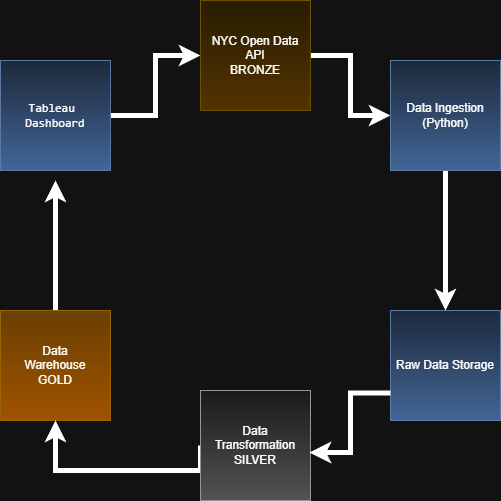

# CIS-4400-Spring-2026-Projects Assem Yehiya

###HW#1

## Problem Context 

Car crashes in New york city are a huge issue, they result in injuries and deaths and damage to property all across the city. To try to improve the safety of people in the city we need to actually see and understand what factors contribute to these accidents and when and where they usually happen. This is the aim of this project. Where ill take the “NYC Motor Vehicle Collisions” dataset from NYC open data and then ill analyze it to try and see if there is any patterns, whether in crash occurrences, injuries, and other factors that may have an impact. By organizing the data into a structured data warehouse and creating visualizations of the data which will help analysts or city officials better understand the data and trends which can allow for solutions to be created.

## Business Requirements

1. Need to identify any crash trends across New York City and in different times
2. Look for and find any contributing factors that are correlated with injuries and deaths
3. Give the final product to Analysts and city officials for safety planning

## Functional Requirements

1.The System must get the “motor vehicle collision” data from the nyc open data, using either a API or just downloading it as a csv

2.The system has to store the raw data in a centralized storage environment to process later 

3.The system has to transform and clean the data, including making dates into standard formats and filling or removing missing or duplicate values. 

4.The system has to then load the cleaned data into a data warehouse with facts and dimension tables

5.The system should have data able to made into visualization and also querying to see crash trends, deaths, and any factors or possible causes using analytic tools

## Data Requirements

1. This project will use the “nyc motor vehicle collisions” dataset from NYC open data. This dataset has very detailed, and event level records of crashes that have been reported across the city. It’s got more than a million records and also more than 20 columns.

2. Each row is one collision event, and the columns are attributes like, date, time, locations, number of injuries,deaths, factors, and vehicle types. 

3. The data can be downloaded in a csv format or by using the API for processing. 

4. A custom dictionary was made to document the selected fields, it lists their description, data types. And constraints. 

5. This data is a good use for data warehousing because it has structured, transactional data and can also be analyzed across multiple different dimensions, such as time, locations, and factors.

## Information Architecture

1. The architecture of the system shows how data flows from the actual data source or NYC open data all the way until it reaches the users in the end.
2. The collision dataset is retrieved by downloading it in a csv format and stored both locally and in a cloud environment 
3. The data is then cleaned and transformed before being loaded into a data warehouse
4. The data warehouse lets us efficiently query and analyze the crash info.
5. Finally using power bi or tableau we make visualizations that are used to better show analysts and officials insights about the information

## Data Architecture

1. The data architecture is the flow of how data is collected, processed, and stored within the system. The nyc open data API would be the data source.

2. Which is then downloaded and then stored as a csv in a cloud storage format, this is then loaded into python for cleaning and processing using pandas and making sure that there are no errors or values that aren't needed.

3. Then we take the processed data and load it into a data warehouse using dbschema for example and organize it into fact and dimension tables. This once again allows better efficiency when analyzing, the final data is used in Tableau to create dashboards and visualizations.

## Dimensional Modeling

1. The Grains is: one row = one motor vehicle collision
2. The data warehouse is made using a star schema with a central fact table and multiple dimension table around it.

3. The “Fact_crash” table consists of motor vehicle collision events and has measures like the number of injuries or deaths.

4. The dimensions tables include:
-Dim_date, which captures time related attributes of the crash
-Dim_location, has geographic details
-Dim_vehicle, describes car types involved
-Dim_contributing_factor: gives causes of collisions

## Data Sources

Dataset: Motor Vehicle Collisions: Crashes  
Source: NYC Open Data  

[View Dataset](https://data.cityofnewyork.us/Public-Safety/Motor-Vehicle-Collisions-Crashes/h9gi-nx95)

## Data Dictionary

[Data Dictionary](Data%20Dictionary/data_dictionary.xlsx)
