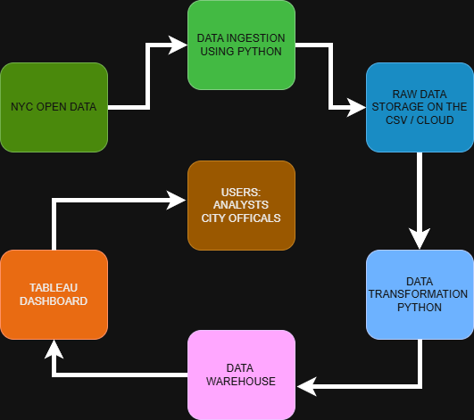

# CIS-4400-Spring-2026-Projects
HW#1

## Problem Context
Motor vehicle collisions are a big thing in terms of a public safety issue in the city, they result in injuries, deaths, and a lot of property damage every year. To be able to understand when and where these accidents occur and what the factors are that contribute to them is very important for improving road safety for everyone. This project takes the NYC Motor Vehicle Collisions dataset from NYC Open Data and analyzes it to identify patterns in crash occurrences, injuries, and different factors in play. By organizing the data into a structured data warehouse and  making analysis easier using visualizations, the system can help transportation analysts and city officials better see accident trends and support safety planning thats backed up by data.

## Business Requirements

1. To analyze motor vehicle collision trends across NYC boroughs and time periods.
2. see what contributing factors associated with injuries and fatalities.
3. Give insights to support transportation safety planning.

## Functional Requirements

1. The system must retrieve motor vehicle collision data from the NYC Open Data source using an API or dataset download. (I dowloaded the dataset)

2. The system must store the raw collision data in a centralized data storage environment for further processing.

3. The system must transform and clean the data, including standardizing date formats and handling missing or duplicate values. (I will use python for this)

4. The system must load the processed data into a structured data warehouse consisting of fact and dimension tables. 

5. The system must support querying and visualization of crash trends, injuries, and contributing factors through analytical tools.

## Data Requirements

The project uses the NYC Motor Vehicle Collisions dataset from NYC Open Data.
This dataset has detailed records of motor vehicle collisions reported across New York City.

The dataset includes over one million records and more than 20 columns, satisfying the project requirement for a large-scale, non-aggregated data. 
Each row is a single collision event and has attributes such as date, time, location, number of injuries, fatalities, contributing factors, and vehicle types.

The data is sourced through a public API and can also be downloaded in CSV format for processing.
I have created custom data dictionary to document the selected fields, including their descriptions, data types, and constraints.

This dataset is suitable for data warehousing because it has structured, transactional data that can be analyzed across multiple dimensions such as time, location, and contributing factors.

## Information Architecture

The system architecture illustrates how data flows from the NYC Open Data source to the end users.

The collision dataset is retrieved using a data ingestion script and stored in a raw data storage environment.
The data is then processed and transformed before being loaded into a data warehouse.
The data warehouse enables efficient querying and analysis of crash information.
Finally, visualization tools such as Power BI or Tableau are used to present the insights to analysts and decision makers.

## Data Architecture

The data architecture defines how data is collected, processed, and stored throughout the system.

The NYC Open Data data is the data source, which is accessed by downloading the csv file or by using a API in python to ingest the data.
The raw data is stored in a storage layer in CSV or cloud storage format.
The data is then transformed and cleaned using Python and Pandas, making sure there is consistency and also removing duplicates, errors or null values.

The processed data is loaded into a structured data warehouse where it is organized into fact and dimension tables.
This enables efficient querying and analysis. The final data is accessed through Tableau dashboards for visualization and reporting.

## Dimensional Modeling

GRAIN: One row = one motor vehicle collision
The data warehouse is designed using a star schema consisting of a central fact table and multiple dimension tables.

The Fact_Crash table represents individual motor vehicle collision events and includes measures such as the number of injuries and fatalities.

The dimension tables provide descriptive context like:
- Dim_Date captures times and date related attributes of the crash 
- Dim_Location includes geographic details
- Dim_Vehicle describes vehicle types involved
- Dim_Contributing_Factor identifies causes of collisions

This structure allows for efficient querying and analysis across multiple dimensions such as time, location, and contributing factors.

## Data Sources
https://data.cityofnewyork.us/Public-Safety/Motor-Vehicle-Collisions-Crashes/h9gi-nx95/about_data
## Data Dictionary
https://cuny907-my.sharepoint.com/:x:/g/personal/assem_yehiya05_login_cuny_edu/IQCg44abpEGOQKjSZQz94ba2AU2ubqQ3TMem0r32T4--HEs?e=ict8Pu&nav=MTVfezkzQTIyMjNBLTE1OEMtNDg1MC04M0U5LTMxMkUxQkIxREQ1MX0

